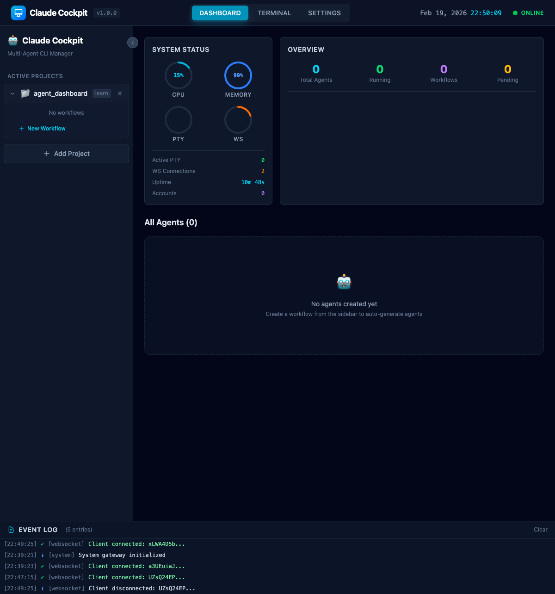

# Claude Cockpit Client

多代理 CLI 管理儀表板的前端應用，用於編排 Claude 代理的終端介面和工作流程管理。



## 功能特色

- **多專案管理** - 同時管理多個專案的工作流程
- **即時終端** - 透過 xterm.js 提供完整的終端體驗
- **工作流程視覺化** - 查看和管理多步驟工作流程
- **多角色支援** - PM、RD、UI/UX、QA、TEST、REVIEW 等角色
- **即時同步** - 透過 WebSocket 與後端即時通訊
- **審核機制** - 工作流程步驟的審核與批准功能

## 系統需求

- Node.js 18+
- npm 或 yarn
- 後端服務運行於 `http://localhost:3001`

## 快速開始

### 方法一：使用啟動腳本 (推薦)

在專案根目錄執行：

```bash
./start-dev.sh
```

此腳本會在 iTerm 中開啟兩個分頁，同時啟動前端和後端：
- Backend: `http://localhost:3001`
- Frontend: `http://localhost:5173`

### 方法二：手動啟動

#### 1. 安裝依賴

```bash
npm install
```

#### 2. 啟動開發伺服器

```bash
npm run dev
```

應用會在 `http://localhost:5173` 啟動。

#### 3. 連接後端

確保後端服務已在 `http://localhost:3001` 運行。可透過環境變數自訂：

```bash
VITE_SOCKET_URL=http://your-server:3001 npm run dev
```

## 開發指令

| 指令 | 說明 |
|------|------|
| `npm run dev` | 啟動開發伺服器 (port 5173) |
| `npm run build` | TypeScript 編譯 + Vite 生產建置 |
| `npm run lint` | ESLint 程式碼檢查 |
| `npm run preview` | 預覽生產版本 |

## 專案結構

```
src/
├── main.tsx              # 應用程式入口
├── App.tsx               # 根元件
├── index.css             # 全域樣式 (Tailwind)
├── types/                # TypeScript 類型定義
├── store/                # Zustand 狀態管理
│   ├── uiStore.ts        # UI 狀態
│   ├── systemStore.ts    # 系統狀態
│   └── agentStore.ts     # Agent & Workflow 資料
├── hooks/
│   └── useSocket.ts      # WebSocket 連接
├── pages/                # 頁面元件
│   └── SettingsPage.tsx  # 設定頁面
├── components/
│   ├── Layout/           # 佈局元件
│   ├── Navigation/       # 導航元件
│   ├── Terminal/         # 終端元件
│   ├── Agent/            # Agent 卡片
│   ├── Workflow/         # 工作流程圖
│   ├── Dashboard/        # 儀表板元件
│   ├── System/           # 系統狀態
│   ├── Task/             # 任務面板
│   └── EventLog/         # 事件日誌
└── utils/                # 工具函數
```

## 技術棧

| 類別 | 技術 |
|------|------|
| Framework | React 19 |
| Language | TypeScript 5.9 |
| Build Tool | Vite 7.3 |
| Styling | Tailwind CSS 4.1 |
| State | Zustand 5.0 |
| Terminal | xterm.js 6.0 |
| WebSocket | Socket.IO Client 4.8 |

## 設定說明

### Claude Plan 設定

在設定頁面可選擇 Claude 方案：
- **Pro** - 約 40 prompts / 5hr
- **Max 5x** - 約 200 prompts / 5hr
- **Max 20x** - 約 800 prompts / 5hr
- **Custom** - 自訂限制

### 專案目錄

在設定頁面可配置專案目錄，新建 Agent 時可快速選擇工作目錄。

## 生產部署

```bash
# 建置
npm run build

# 預覽建置結果
npm run preview

# 部署 dist/ 目錄到你的靜態伺服器
```

## 授權

MIT License
